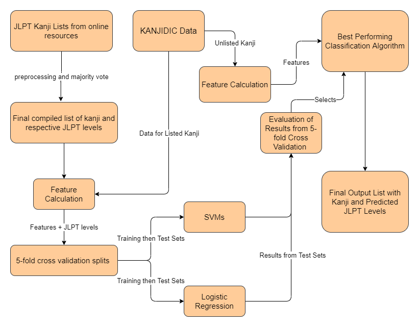

[Repository](https://github.com/nramkissoon/Japanese-Kanji-JLPT-Classification) for data and project code.

## Problem Statement

Predicting the difficulty level of a Japanses kanji character
can be beneficial to language learners. An effective classification 
system can also be an integral component of word and text difficulty classification 
systems. The objective of this design document is to present a design 
for a classification system that will assign difficulty levels to specific kanji characters.

## System Overview

The system will take in a kanji character as input and output a predicted difficulty level.
In order to make a prediction, the system will calculate several
features associated with the character that will be used in a 
trained machine learning model. 

The final output will be a list of all possible kanji used in the Japanese language and 
their respective difficulty levels.

## Experiment Considerations

### Difficulty Classes

The standard for difficulty classification will follow the 
Japanese Language Proficiency Test (JLPT) levels.
There are 5 distinct levels, N5-N1, with N5 being the easiest and 
N1 being the most advanced level. 
A more in-depth description of each level can be found [here](https://www.jlpt.jp/e/about/levelsummary.html). 

### Data

#### Training Observations

To train the ML models, a list of already-classified 
kanji characters is needed. The JLPT does not provide an 
official list of kanji classified by difficulty level. However,
several websites have constructed lists of kanji one should know 
for each JLPT level. These websites are:

1. [https://www.nihongo-pro.com/kanji-pal/list/jlpt](https://www.nihongo-pro.com/kanji-pal/list/jlpt)
2. [https://japanesetest4you.com/](https://japanesetest4you.com/)
3. [https://www.kanshudo.com/collections/jlpt_kanji](https://www.kanshudo.com/collections/jlpt_kanji)
4. [https://kanjiwakaru.com/kanji/](https://kanjiwakaru.com/kanji/)
5. [https://www.jlptstudy.net/](https://www.jlptstudy.net/)

A list of kanji for each JLPT level will be constructed using a majority vote 
rule. If a kanji is listed for a particular level in a majority of the listed online resources,
it will be included in the final list.

**It is important to note that the resulting list will have unbalanced classes.** The N5 level 
consists of ~80 kanji, whereas the N1 level can consist of over 1000 kanji. 

#### Feature Data

[The KANJIDIC Project](http://www.edrdg.org/wiki/index.php/KANJIDIC_Project)
provides a kanji dictionary with a little over 13,000 entries.
Each entry contains useful data such as stroke count, frequency-of-use, readings, etc. which
will be used for calculating features for each character. 

For the final output, the system will be classifying the unlisted kanji from KANJIDIC (most of the 13,000 entries).

### Classification Algorithms

Logistic Regression and Support Vector Machines will be tested.
These are common classification algorithms and should be able to 
perform well without much tuning. Implementations for the algorithms will be 
provided by the Python [scikit-learn package](https://scikit-learn.org/stable/index.html).
The better performing algorithm will be used in the final output.

### Evaluation

5-fold cross validation will be performed using the list of 
pre-classified kanji characters as the training/test data. Cross-validation will 
ensure that results are not overfitting to any single training set. 

Accuracy will be the central performance metric of the classification
algorithms. Precision, recall, and F-score for each level will also be 
taken into account because of the previously mentioned problem of unbalanced classes.

## System Architecture

