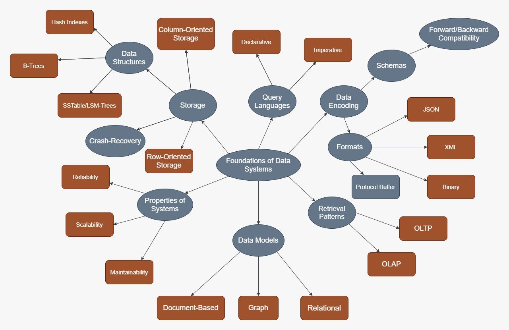

In Designing Data-Intensive Applications, Martin Kleppmann 
discusses problems and solutions that define modern system design where there
is an arms-race between the ever-increasing amount of data collected and 
used in applications and the software and system design paradigms that 
need to keep up and scale with it while also providing acceptable service to end users.

This book is clearly written for working professionals who have 
probably had first-hand experience with distributed systems and all 
the accompanying bugs and issues. Despite this, a computer science student or 
aspiring software engineer will be able to benefit reading this book if they
have some background in databases and their underlying data structures/implementations, networking, and concurrency.
Personally, I was better able to understand topics such as event streams after
completing an internship at Amazon; having gained concrete experience working
with different components of a distributed system naturally helped draw connections from
concepts discussed in the book to real-world applications.

## 1. Foundations of Data Systems

Well designed systems are:
1. Reliable - they work as intended and are fault tolerant
2. Scalable - they can handle growth (users, requests, data, etc.)
3. Maintainable - engineers can monitor and make changes without creating unnecessary downtime

When designing data-intensive systems, every decision should be evaluated based on its impact on reliability, 
scalability, and maintainability. In almost all cases, a trade-off is present. 
The job of the designer is to identify the trade-offs and make educated decisions based on the requirements of the system. Even then,
designers cannot expect their designs to always be optimal because requirements evolve with business needs.

In the first sections of the book, Kleppmann focuses on decisions that need to be made even if the entire 
system is just one machine; the reasoning behind this is that a system design should work well for one machine
or else it will be difficult to scale to several servers in a distributed system. These decisions involve determining 
how data will be represented, stored, and used in the system. More specifically, we need to decide what data models to use and 
what retrieval patterns do we expect for the data by other applications.

### Data Models

For data models, there are 2 primary options: the relational and document models.

| Relational Model | Document Model |
|------------------|----------------|
|schema-on-write| schema-on-read|
|better join support|poor join support|
|impendance mismatch (disconnect between application code and database models)|JSON formats tend to have lower impendance mismatch|
|can model one-to-many, many-to-one relationships|cannot easily refer directly to nested items|
|declarative languages like SQL provide behind-the-scenes query optimization|imperative languages perform DB operations in the specified order, regardless of performance|

Modern relational and document databases have converged in terms of performance and what features they offer.
Reliable and scalable systems can be built with either data model. What should drive the 
decision-making process between the 2 models is maintainability. 

A poorly chosen data model 
will lead to maintainability issues further down the road because data naturally evolves and tends to become
more interconnected and complex. The schema flexibility offered by document-based models is a good hedge against increasing 
complexity as new data fields can be simply added without the changing of schemas or creating new tables that would occur in the relational case. 
Despite this, problems arise when the interconnectedness of the data warrants the modelling of both one-to-many and many-to-one relationships.
In this case, relational data models would be a better solution. 
Document-based models often offer JSON as a data format for representing 
database entries. JSON is easy to work with in most programming languages, making
development easier/faster, however, nested items are not easily accessible. If requirements change such that 
a data field that is nested deep inside the document tree needs to now be accessed frequently, maintainability issues arise as application code becomes more complex to support this requirement.

### Retrieval Patterns

Data retrieval patterns define the read and write requirements for a database.
The book discusses 2 main patterns for data retrieval and usage.
Web applications, social networks, and other common systems where there are several users
reading data and updating/posting new data fall under **online transactional processing** (OLTP) use cases. 
Users read and write small amounts of data at a time, but they expect these operations to be instant and interactive.
The other pattern involves reading large chunks of data (or the entire database) at once to perform
some calculations/aggregations. This is a **online analytic processing** (OLAP) use case and a common task performed by business 
analysts and engineers. 

This chart borrowed from the book illustrates the differences between OLTP and OLAP:

|Property|OLTP|OLAP|
|--------|----|----|
|Main read pattern|small number of records per query|aggregate over large number of records|
|Main write pattern|random-access, low-latency writes|bulk import, event streams|
|Primarily used by|end-users|internal analysts, engineers|
|What data represents|latest state of data|history of events|

Because OLTP and OLAP systems serve very different purposes, it has become common practice to separate 
the 2 even if they essentially represent the same data. Large enterprises now use data warehouses 
optimized for bulk reads for their OLAP needs. Data warehouses diverge significantly from 
relational and document databases used for OLTP in implementation. For example, techniques such as column-oriented storage
are used in data warehouses because they make bulk reads more efficient.

### Other Considerations

In Part 1, Kleppmann also discusses topics such as the underlying data structures that 
store data efficiently in a database and different data encoding methods/tools. 
These topics are good to know for the sake of better understanding how databases work
under the hood. However, the purpose of database software is to abstract away from working directly 
with the file system and data structures like B-trees. As long as application data is modelled correctly and proper 
care is taken in defining read and write expectations, any modern database engine should suffice without having to think about 
its underlying implementation. 

In the subsequent parts, things will get more complex as more machines will be introduced into the system.
As the system scales, networking and database concurrency problems begin to negatively impact reliability and maintainability.
Much of the research in distributed systems aims to develop solutions to these issues that will be discussed in the next post.
