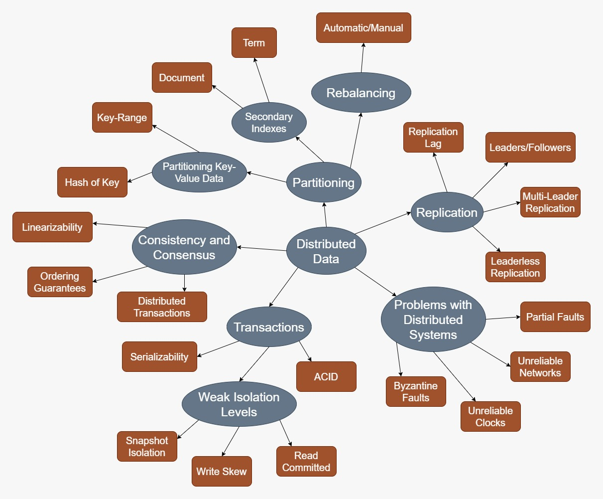

Part 2 of Designing Data Intensive Applications is about distributed data.
Distributed date is data that has been split/copied/shared amongst two or more machines.
Distributing data across multiple machines makes sense from a perspective of 
increasing scalability as more machines should be able to handle higher amounts of data and 
perform operations on that data concurrently. This part discusses replication and partitions as the 
most common techniques for distributing data across multiple machines. Each come with their own set of 
design considerations and use cases, and usage of both is widespread in real-world applications where 
scalability is necessary.

By scaling beyond a single machine handling all the data,
special care must be taken to ensure the data stored in all machines in the distributed system is 
reliable. In an ideal world, all nodes in the system should agree on all data and a node never fails (i.e. shuts down, crashes, etc.).
Of course, machines fail all the time and need to be rebooted or replaced, and because machines are often 
spread out in a vast network handling changing data concurrently, consistency and consensus issues need to be addressed. 
Network lag, node outages, clock differences across nodes, etc. make designing distributed systems complicated. 
No system completely eliminates these issues; realistically, system designers have to consider tradeoffs between 
metrics such as performance vs. database consistency and what the system requirements are in order to mitigate
as much as possible.

The following sections will cover 5 major topics in distributed data and each of their underlying concepts as 
structured by the book.

## 1. Replication

**Replication** is the copying of data across multiple nodes over a network. 
This can be useful for keeping data geographically close to a widespread user base, having redundancy in case
a node fails, or increasing read throughput of data linearly with the amount of nodes available.

When coming up with an implementation for replication, it is natural to ask the following questions:

1. Which node's data should be copied to the rest of the nodes, how do we know this node's data is correct (most up-to-date)?
2. How do we minimize the time it takes for a database change to proliferate to all nodes?
3. How do we handle failed nodes? 

### Leaders and Followers

A simple replication implementation is to designate a single node as a **leader** and all other nodes as **followers**.
All client writes are routed to the leader, ensuring that the leader has the most recent data. Leaders can then send the updated database values to
follower nodes either **synchronously**, **asynchronously**, or a mix of the two.

In **synchronous** replication, a client sends a write to the leader, the leader does not indicate to the user that the operation was successful until all followers have been updated.
In **asynchronous** replication, the leader can indicate a write was successful without waiting for all the followers to update.

If a leader fails, a follower node must be elected to be the new leader. This can be problematic 
in systems where replication is asynchronous and the followers may not have the most recent data.
Even then, the follower with the most recent data should be elected to be the new leader, and new write requests should be routed to it.
Care must be taken that there is a consensus on which node should be the new leader to avoid multiple nodes
being elected to leader.

If a follower fails, but can be restarted, nodes typically have change logs that can be used in catch-up recovery.

Because it takes time to replicate data to followers, **replication lag** becomes a concern for applications where users expect to see their changes immediately.
Writes are always sent to the leader, but reads requests can be sent to any node. Therefore, if a user sends a write request for some value to the leader, then 
immediately reads the same value from a different node, the read may have an old value because the change has not propagated yet.
A way to mitigate this problem is to limit read requests to a recently updates value to just the leader for a long enough time such that all followers are up-to-date.

It is also possible for the user to read the new value from a replica that received the update, but a subsequent read for the same value routed to 
another node returns the old value because that node has not been updated yet. This situation gives the illusion that the data is moving backwards.
**Monotonic reads** solve this problem by simply having subsequent read requests for the same value be routed to the same node for some time until all other nodes are updated.

### Multi-Leader Replication

A system with a single leader is able to scale well with increasing read requests because any node can process read requests. 
However, because all writes must go to the leader, write capacity is limited by what a single leader can handle and does not scale with increasingly write-heavy applications.
Multi-leader replication systems allow multiple leaders to exist and accept writes from clients, allowing the system to scale with both read and write request increases.
This increased scalability comes at the cost of introducing write conflicts and a need to handle them.
Updates to the same value can come from different clients and routed to different leaders, leading to a write conflict.

Some methods of handling write conflicts include:

1. Conflict avoidance - avoid conflicts entirely by only allowing write request for a specific record to only be routed to a single leader
2. Converging to a consistent state - all replicas eventually arrive at the same value through means such as **last write wins**, merging values, etc.

### Leaderless Replication

In leaderless replication, the concept of leader and follower does not exist; reads and writes are routed to all nodes.
Because replication lag still exists, read requests are sent to several nodes in parallel, and nodes return whatever value they currently have stored.
The user can receive both the correct, most recent value **and** stale, older values. 
Version numbers can determine the most recent value.

**Quorum** reads and writes are used to minimize the probability of getting stale values or guaranteeing at least 
one returned value is the correct value (depending on the number of nodes that are read from or written to per request). 
Quorums can provide tolerance against outages and failed nodes, but having clients read and write to multiple nodes at a time can introduce
latencies that may be unacceptable. This is a tradeoff between performance and database reliability in terms of minimizing the 
occurrence of stale values.

Like in the multi-leader case, leaderless replication must also handle write conflicts because any node can 
accept write requests. Similar methods are used in conflict resolution such as avoiding conflicts by imposing 
a hierarchy onto concurrent writes, merging values, or storing multiple values for each key.

## 2. Partitioning

### Partitioning Key-Value Data

### Partitioning Secondary Indexes

### Rebalancing Partitions

## 3. Transactions

### ACID

### Serializability

### Weak Isolation Levels

## 4. Consistency and Consensus

### Linearizibility

### Ordering Guarantees

### Distributed Transactions

## 5. Problems with Distributed Systems

### Partial Faults and Failures

### Unreliable Clocks

### Unreliable Networks

### Byzantine Faults
