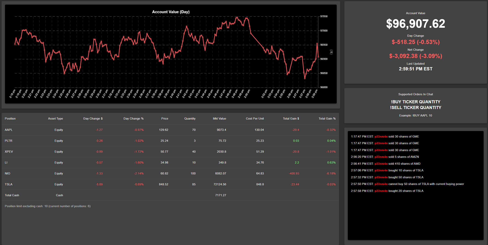

[https://www.twitch.tv/twitchstocksimulator](https://www.twitch.tv/twitchstocksimulator)

A recent obsession with Twitch has led to a flow of ideas related to 
creating games and experiences that involve Twitch chat. One of which 
is a stock market simulator where chatters share an account with an
initial pool of cash and they enter buy and sell orders in chat. Gains, 
losses, current positions, and other account data would be streamed 
so chatters can know how they are doing. These are the high-level requirements 
I wanted to implement. In the sections below, more in-depth descriptions of the system's 
components are provided.

## Order Reading Chatbot

### Requirements

1. Ability to detect orders as they are entered in chat
2. Sending orders to backend server to be processed

### Description

Implementing a Twitch chat bot was simple with the [tmi.js module](https://github.com/tmijs/tmi.js).
Regular expressions are used to catch chat messages that are orders.
Orders and user data is sent to an AWS SNS topic which in turn sends the data to the backend server via an HTTP POST API.

## Order Processing Backend Server

### Requirements

1. Accept orders from AWS SNS Topic
2. Validate orders based on account limitations such as buying power
3. Request quote data from 3rd party market data API
4. Execute orders and update DynamoDB databases with new account state based on executed 1.

### Description

To process orders, an NodeJS and Express backend server is implemented with API endpoints to receive orders from AWS SNS and query 
DynamoDB for account data. The server updates the account at regular intervals by reading current account data and positions from 
DynamoDB, getting current market data from the market data API, and calculating and writing the updated data back to the database.
Updates are also run every time orders come in from AWS SNS and are processed. 

## Streamed React Frontend 

### Requirements

1. Read account data and order history from DynamoDB
2. Display order history in a chat-like manner 
3. Display a graph of account value over time
4. Display current positions and account value gains and losses

### Description

The frontend was developed using React and the [Material-UI component library](https://material-ui.com/).
Chart.js was also used to create the account value graph. 

Here is a screenshot of the finished interface:

Further visual improvements can be made as well as some more functional improvements to display more information such as
market status (time to open/close), market data API status, etc. 
